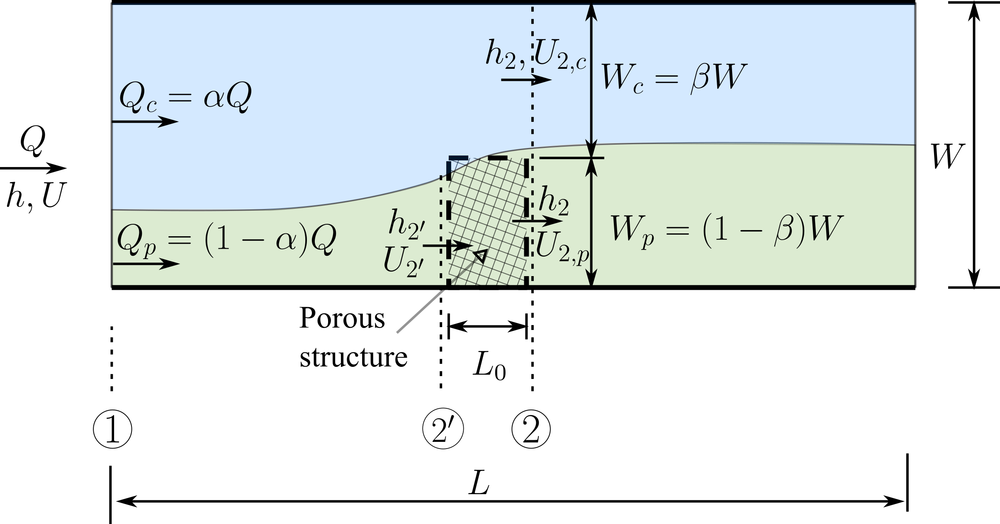

# Flow Partition with Porous Structure in Open Channels

This repository has the solution scripts and simulation cases for the paper "Flow Partition in Two-Dimensional Open Channels with Porous Structures". The problem setup is shown in the following figure. The key question addressed in the paper is how to compute $\alpha$ as a function of Froude number $Fr$, channel opening ratio $\beta$, and drag coefficient $C_d$.

<p align="center">
  
  <br>
  <em>Figure 1: Schematic diagram of flow partition due to a porous structure in an open channel.</em>
</p>

## Prerequisites

### Clone the repository

```bash
git clone https://github.com/psu-efd/flow_partition_porous_structure.git
```

### Create a conda environment
The following command creates a conda environment using the `environment.yml` file. All necessary packages are included in the `environment.yml` file, except for `pyHMT2D`.

```bash
conda env create -f environment.yml
```

### Install pyHMT2D
Install the latest version of `pyHMT2D` from the GitHub repository. `pyHMT2D` is a Python package for automating computational hydraulics modeling. In this work, it is used to preprocess, run, and postprocess the 1,000 SRH-2D simulation cases. You will also need to install SRH-2D, for example, installing SMS from Aquaveo, which comes with the SRH-2D solver.

```bash
pip install git+https://github.com/psu-efd/pyHMT2D.git
```

## SRH-2D Simulations

The SRH-2D simulation cases are in the `SRH-2D_cases` folder, which has two subfolders: `flow_partition` and `flow_partition_flume_experiments`. The `flow_partition` folder contains the 1,000 simulation cases which sweep the parameter space spanned by $\alpha$, $Fr$, and $\beta$. The `flow_partition_flume_experiments` folder contains the simulation cases for the four flume experiments. To calibrate the drag coefficient $C_d$ for the flume experiments, we use the Gaussian Process optimization. 

### Python scripts

The main Python script for this work is in the `scripts` folder named `flow_partition_porous_structure.py`. This script contains the following main functions:

- solve the simple model described in the paper
- make various plots shown in the paper


